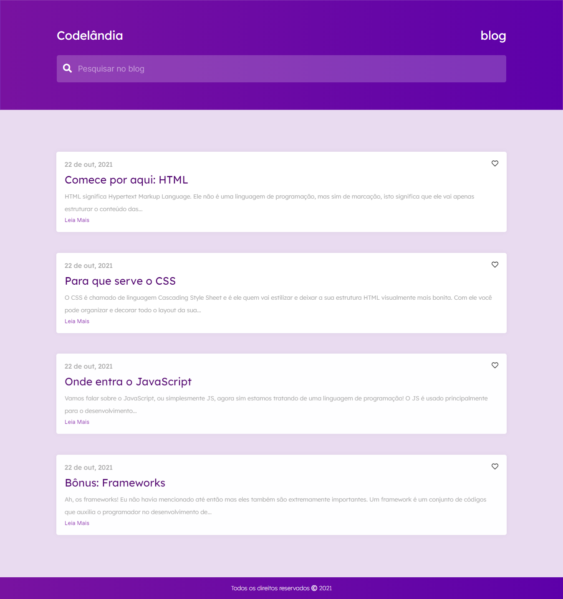

# Blog - Codelândia

<h2>📝 Sobre</h2>

Projeto desenvolvido a partir do desafio 1 proposto pelo Iuri Silva (iuricode) na comunidade Codelândia do Discord.

 
<h2>🎯 Objetivo</h2>

O objetivo era fazer uma página de blog simples com responsividade e um pouco de animação. No conteúdo coloquei um pouco do meu conhecimento sobre os conceitos de HTML, CSS, JS e Frameworks.

<h2>💻 Tecnologias</h2>
<ul>
    <li>HTML</li>
    <li>CSS</li>
    <li>JavaScript</li>
</ul>

<h2>📸 Imagem do site</h2>

<h2>🔗 Link</h2>

<a href="https://adoring-bhabha-172cdb.netlify.app">Clique aqui</a>

<h2>📧 Entre em contato:</h2>
  

  

  

